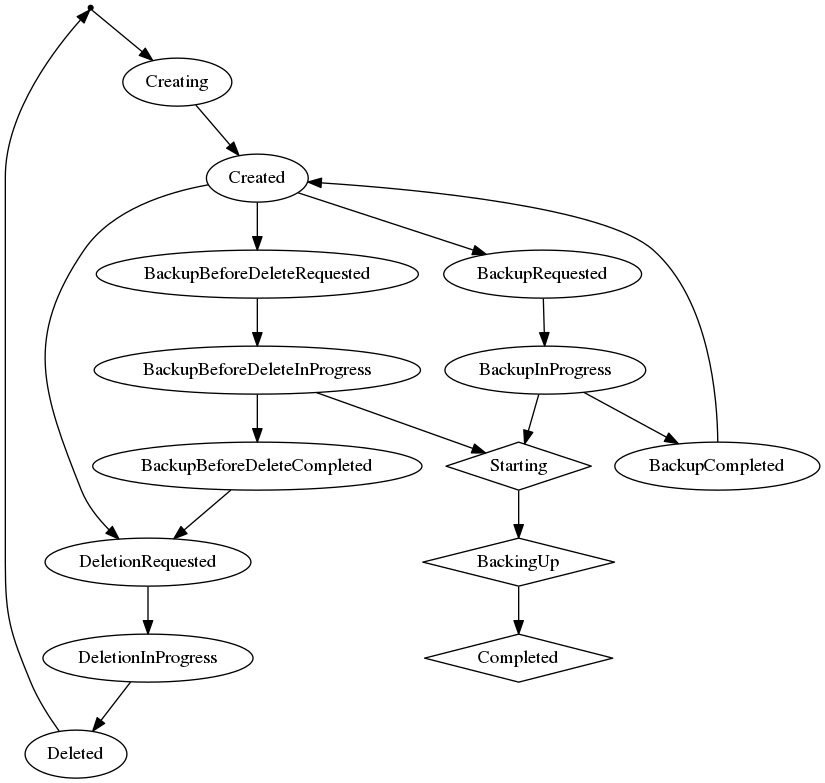

# db-operator

A Kubernetes operator for managing databases. This operator does **NOT** manage the creation or deletion of database instances (i.e. actual installations of a database server). The lifecycle here is of a schema or database within an instance.

db-operator will work with databases hosted within your cluster, or elsewhere such as an Amazon RDS instance.

Conceptually db-operator decouples the lifecycle of a database **instance** from that of a **database**.  Many RDBMSes use different terminology here, but all of them support the idea of many "databases" within one "instance".

This is particularly useful when running many production or pre-production workloads within one Kubernetes cluster sharing a single database instance, which is a common deployment pattern.

## Lifecycle

This diagram shows both the state of the database resource (ellipses) and the backup resource (in diamonds):

## Resources and states 

### `database`

This is a database/user/schema within a database cluster/instance.

Generally this will involve creating a user with a password, and then creating a
database owned by that user.  Implementations are provided for PostgreSQL and MySQL.

#### Database States

When a database resource is first created it has no `state` status. The operator delegates state changes to a `provider` which makes changes to the state as appropriate, using the `db-operator provider API`.

- **CREATING**: The `provider` has begun creating the database
- **CREATED**: The `provider` has created the database and it is ready for use. A secret now exists, with the same name and namespace as the database, containing everything required to use it.
- **BACKUP_REQUESTED**: A backup of this database has been requested but has not yet begun
- **BACKUP_IN_PROGRESS**: A backup is in progress. Only one backup may be active at any one time.
- **BACKUP_COMPLETED**: Backup has been completed. Will then move back to CREATED.
- **DELETION_REQUESTED**: Database deletion (without a backup) has been requested.
- **DELETION_IN_PROGRESS**: The database is being deleted.
- **DELETED**: The database has been deleted. At this point the database resource itself will be removed.
- **BACKUP_BEFORE_DELETE_REQUESTED**: The database will be backed up and then deleted
- **BACKUP_BEFORE_DELETE_IN_PROGRESS**: The database is being backed up before deletion
- **BACKUP_BEFORE_DELETE_COMPLETED**: The database has been backed up and will move to **DELETION_REQUESTED** shortly.

### `backup`

This is a backup of a database, stored on some remote object store such as S3.

#### Backup States

When a backup resource is first created it has no `state` status.

- **STARTING**: The `provider` is beginning a backup.
- **BACKING_UP**: The `provider` is backing up. The Status will also include a destination attribute showing where the backup is being written to. It may also optionally include a progress.
- **COMPLETED**: The backup has completed.  The resource will not be deleted automatically.
